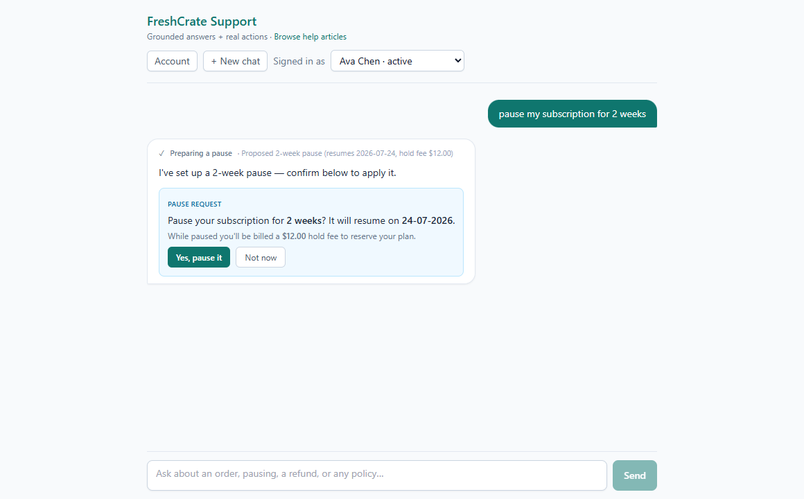

# FreshCrate Support Agent

> If you wish to look at the development process and motivations behind the project head over to the [Dev Log](/docs/DEVLOG.md).

## Description

An agentic AI customer-support assistant for a fictional meal-kit subscription company. It answers help questions grounded in a knowledge base **with citations**, and performs **guard-railed account actions** (order lookup, subscription pause/resume/cancel, plan changes, refunds, escalation) against a Postgres database — behind safety, scoping, and cost controls.

This is a **portfolio project**. The fictional company is just the demo surface; the engineering patterns — agentic RAG, guarded tool use with human-in-the-loop confirmation, prompt-injection resistance, and a deterministic test harness — are the deliverable.

> **Status:** live demo deploying shortly — URL coming here. Until then, it runs locally in about five minutes (see [Quick start](#quick-start)).

<!-- SCREENSHOT PLACEHOLDER -->
<!-- Add docs/img/demo.png — a clean capture of a chat turn showing a tool-call
     status chip + a confirmation card (e.g. the refund card). Best taken with
     the deterministic MOCK_LLM mode so the output is stable. -->


---

## Demo: things to try

The app has a customer selector (a simulated "logged-in" customer — no real auth). Each seeded customer exercises a specific behavior:

| Sign in as | Ask | What it shows |
|---|---|---|
| **Ava Chen** (active) | "Where's my latest order?" | Scoped `lookup_order`, status + delivery date |
| **Ava Chen** | "How do I pause my plan?" | Grounded KB answer **with a citation** |
| **Marcus Bell** (2 open orders) | "Cancel my order" | Clarify-on-ambiguity — asks *which* order |
| **Priya Raman** | "My last box was damaged, I'd like a refund" | Refund **confirmation card** (never auto-charges) |
| **Noah Patel** | "Refund my last order" | Over-the-ceiling refund → **escalates to a human** |
| **Lena Kowalski** (cancelled) | "Reactivate my subscription" | Free reactivation within billing period |
| **Diego Santos** (paused) | "Resume my subscription" | Immediate, free resume |
| anyone | "What's the capital of France?" | Politely declines — stays on-topic |

Every account action follows a **propose → confirm** flow: the model proposes, a card appears, and the write only happens when you click confirm.

---

## What it demonstrates

| Capability | Where it lives |
|---|---|
| **Agentic RAG** — retrieval is a tool the agent chooses to call, answers cite article + section | `lib/rag/`, `lib/tools/search.ts` |
| **Guarded tool use** — human-in-the-loop confirmation; the model never writes | `lib/tools/refund.ts`, `lib/guardrails/`, `app/api/actions/*` |
| **Agent loop** — think → act → observe over OpenAI function calling | `lib/agent/loop.ts` |
| **Least privilege & customer scoping** — every tool is bound to the trusted server-side customer id; no general SQL tool | `app/api/chat/route.ts`, `lib/tools/*` |
| **Prompt-injection resistance** — KB/DB content treated as data, not instructions | `lib/agent/prompt.ts`, `lib/domain/terms.ts` |
| **Abuse & cost controls** — input cap, output cap, agent-loop ceiling, rate limit | `app/api/chat/route.ts`, `.env.example` |
| **Domain source of truth** — terminology and business rules in one place | `lib/domain/terms.ts`, `docs/DOMAIN.md` |
| **Deterministic test harness** — unit + integration + E2E with a mock LLM provider | `lib/**/*.test.ts`, `cypress/`, `lib/llm/mock.ts` |

---

## Architecture

```
Browser (React chat UI, SSE streaming, tool-call status, confirmation cards)
        |
        v
POST /api/chat  ── builds a trusted customerLabel from the selected customer
        |
        v
Agent loop (lib/agent)  think → act → observe over OpenAI function calling
   |            |              |                 |
   v            v              v                 v
search_kb   order/sub tools  guardrails      streamed SSE events
(pgvector)  (11 typed tools) (scope, ceiling) (delta, cards, sources)
        |
        v
PostgreSQL + pgvector   (relational tables + KB vectors)
```

- **Confirmation actions never write from the model.** The model calls a tool that *proposes*; the card's confirm button hits a re-validating `/api/actions/*` endpoint that performs the write.
- **Why agentic RAG?** KB search is a tool the agent decides to call, not an always-on step — it supports multi-step retrieval and demonstrates agent reasoning (see the ADRs in `support-agent-prd.md`).

Deeper detail lives in [`docs/PROJECT_STATE.md`](docs/PROJECT_STATE.md) (as-built architecture & conventions) and [`docs/DOMAIN.md`](docs/DOMAIN.md) (terminology & business rules). The original spec is [`support-agent-prd.md`](support-agent-prd.md).

---

## Tech stack

| Layer | Technology |
|---|---|
| Framework | Next.js 14 (App Router) + TypeScript |
| UI | React 18 + Tailwind CSS |
| Database | PostgreSQL + pgvector (local Docker `pgvector/pgvector:pg16`, or Supabase) |
| ORM | Drizzle ORM (`postgres.js` driver) |
| Chat model | OpenAI `gpt-4o-mini` (behind a swappable provider interface) |
| Embeddings | OpenAI `text-embedding-3-small` |
| Keys | Only `OPENAI_API_KEY` needed (no Anthropic) |
| Deploy | Vercel |

---

## Quick start

**Prerequisites:** Node 20+, Docker (for the local database) **or** a Supabase Postgres connection string, and an OpenAI API key.

```bash
# 1. Install
npm install

# 2. Configure env
cp .env.example .env          # set OPENAI_API_KEY; DATABASE_URL defaults to local Docker

# 3. Start the local database (skip if using Supabase)
npm run db:up

# 4. Create schema + seed demo data (enables pgvector, pushes tables, seeds)
npm run db:reset

# 5. Embed the knowledge-base articles into pgvector
npm run kb:ingest

# 6. Run the app
npm run dev                   # http://localhost:3000
```

Useful scripts: `npm run db:studio` (browse data in Drizzle Studio), `npm run db:seed` (reset demo data), `npm run kb:test` (retrieval sanity check), `npm run typecheck`.

---

## Testing

```bash
npm test                  # unit tests (Vitest) — fast, no DB
npm run test:integration  # tool tests against the seeded local DB (needs db:reset)
npm run kb:test           # KB retrieval gate
npm run typecheck         # tsc --noEmit

# End-to-end (deterministic mock LLM):
npm run dev:mock          # start the app with MOCK_LLM=1 (scripted, no API cost)
npm run cypress           # in a second terminal, once the server is up
```

The **mock LLM provider** (`lib/llm/mock.ts`, enabled by `MOCK_LLM=1`) returns scripted tool-calls and answers, making both the loop unit tests and the Cypress suite fast, free, and 100% deterministic. Real OpenAI is used in dev and production.

---

## Project status & roadmap

Built in phases; each phase has an acceptance gate.

| Phase | Deliverable | State |
|---|---|---|
| 0 — Scaffold & data | Repo, env, Drizzle schema, seed | ✅ done |
| 1 — RAG retrieval | KB articles, ingest, retrieval + rerank | ✅ done |
| 2 — Grounded chat | Chat UI, streaming, cited answers, honest "I don't know" | ✅ done |
| 3 — Agentic tools | Typed tools + agent loop + customer scoping | ✅ done |
| 4 — Guardrails | Refund confirmation, ceiling, injection handling | ✅ done |
| — Account/billing layer | Subscription lifecycle, plan pricing, add-ons, transactions ledger | ✅ done |
| 4.5 — Loop & contract hardening | Deterministic loop, richer tool contracts, Vitest + Cypress + mock LLM | 🔧 in progress |
| 5 — Evals | Eval cases + runner + LLM-as-judge | ⬜ planned |
| 6 — Cost & observability | Model router, per-turn cost tracking, dashboard | ⬜ planned |
| 7 — Polish & deploy | Live deploy, demo walkthrough, docs | ⬜ planned |

---

## Limitations / where it fails

- **Single shared demo database** — not multi-tenant by design. Actions mutate shared demo data; `npm run db:seed` resets it.
- **All billing is simulated** — refunds, fees, and charges are DB writes, not real payments.
- **No real authentication** — a customer selector stands in for a login.
- **LLM function-calling is non-deterministic** — the model occasionally describes an action instead of calling the tool; the loop mitigates this (nudge + de-dupe) but it's inherent. The Phase 4.5 hardening + eval suite exist to bound this.
- **Escalations are simulated** — no real human follows up; the assistant says so.

---

## Security notes (OWASP-LLM aware)

- **Prompt injection (LLM01):** knowledge-base excerpts and database rows are treated strictly as *data*, never instructions — including content inside `<<BEGIN … >>` markers. An eval case (Phase 5) verifies injected instructions are ignored.
- **Excessive agency (LLM08):** tools are typed and least-privilege; there is no general SQL tool; write actions require explicit human confirmation via a re-validating server endpoint.
- **Insecure output / over-scoping:** every tool is bound to the trusted server-side `customerId` — cross-customer access is refused even if requested.
- **Unbounded consumption (LLM10):** input length cap, hard `max_tokens`, agent-loop iteration ceiling, per-session rate limit, and a provider-side spend cap.

---

## License & disclaimer

Demo / portfolio project. "FreshCrate" is fictional; all customers, orders, and payments are simulated. Not affiliated with any real company.
